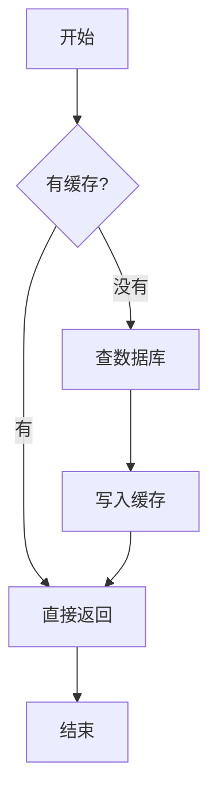
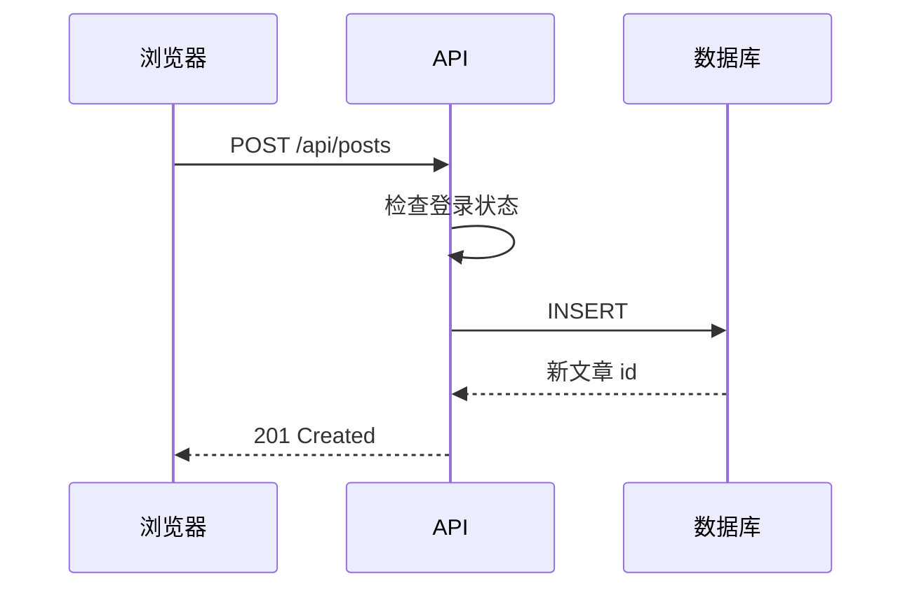
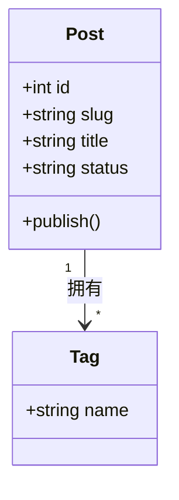

> 这是一个临时测试页面（`draft: false`），验证完就删。

## 行内公式

质能方程 $E = mc^2$，还有欧拉恒等式 $e^{i\pi} + 1 = 0$。

圆周率约等于 $\pi \approx 3.14159$。

## 块级公式

二次方程求根公式：

$$
x = \frac{-b \pm \sqrt{b^2 - 4ac}}{2a}
$$

常用的求和公式：

$$
\sum_{i=1}^{n} i = \frac{n(n+1)}{2}
$$

矩阵乘法：

$$
\begin{pmatrix} a & b \\ c & d \end{pmatrix}
\begin{pmatrix} x \\ y \end{pmatrix}
=
\begin{pmatrix} ax + by \\ cx + dy \end{pmatrix}
$$

带希腊字母和上下标：

$$
\theta_{i+1} = \theta_i - \eta \nabla_\theta J(\theta_i)
$$

## 流程图

## 时序图

## 类图

